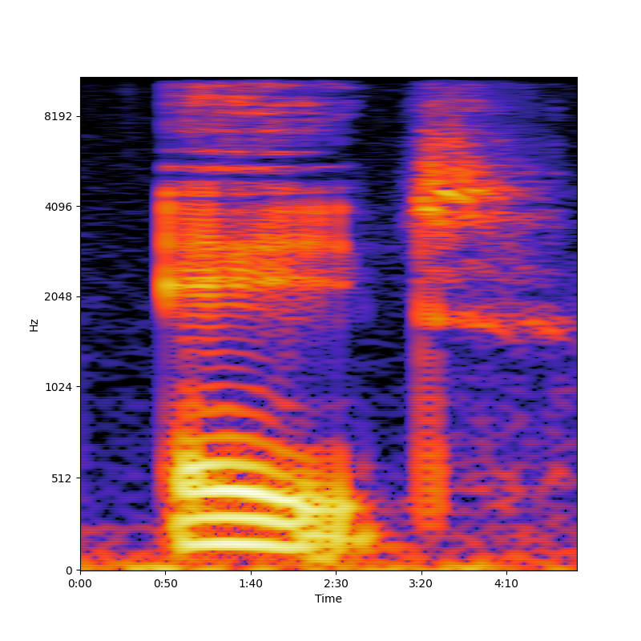
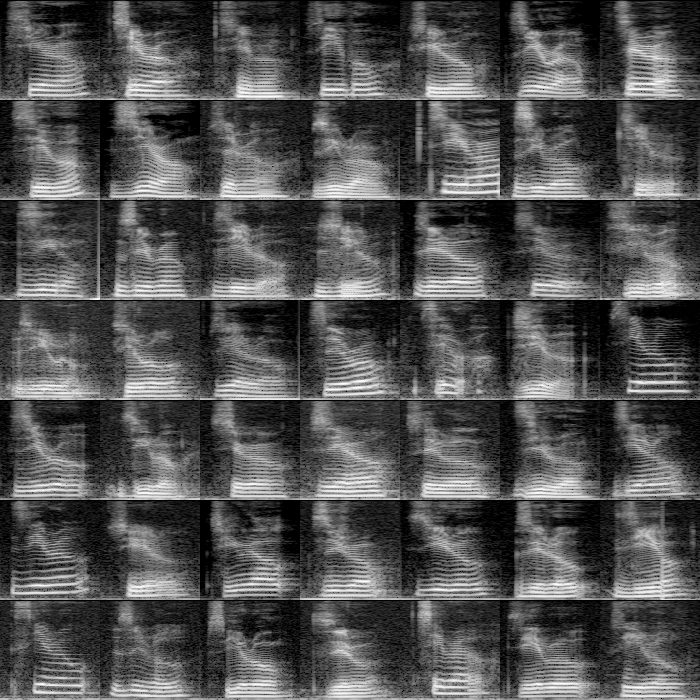

# Neural Audio Classification

The goal of this project is to classify audio using a neural network.

## Preparation

For this project, a neural network will be trained to classify which digit (0-9) is being spoken in an audio recording.

Before training a neural network, a dataset of spoken digit audio recordings must be obtained and converted into a
format that a neural network can use.

### Dataset

This project uses the [Audio MNIST](https://github.com/soerenab/AudioMNIST) dataset, which contains 30,000 audio samples 
of spoken digits from 60 different speakers.

Having a large selection of audio recordings from many different speakers ensures that the neural network will be
accurate and versatile.

### Image Conversion

Because the neural network used for this project takes images as input, the audio dataset will need to be converted to
images.

One well-known method of converting audio data into an image is by using the 
[Fast Fourier Transform](https://en.wikipedia.org/wiki/Fast_Fourier_transform), which can decompose a wave signal into
its discrete frequencies.

Discrete frequencies measured at discrete time intervals can represent information of a sound wave. To create an image,
time can be mapped to the horizontal axis, frequency to the vertical axis, and the amount of a frequency as color.

This creates a [spectrogram](https://en.wikipedia.org/wiki/Spectrogram):

Using three-channel RGB colors make spectrograms easier to read for humans, however, only one channel is necessary for a
neural network, so grayscale images will be used for this project.

The images have also been output as 100x100 for a balance between speed and performance when training the neural 
network.

The [spectrogram.py](src/spectrogram.py) file converts each audio file from the dataset into a spectrogram image.

## Training

With the dataset prepared and formatted, the neural network can be created that will train on the data to accurately
classify a digit given a spectrogram.

For this project, a convolutional neural network will be used.

### Convolutional Neural Network

A [convolutional neural network](https://en.wikipedia.org/wiki/Convolutional_neural_network) trains on data by using
filters, allowing the model to recognize abstract features of data.

Feature recognition is useful for image classification because the model can train to recognize visual features, such as
shape and color.

The following image is an example layout of the layers of a convolutional neural network:

The [neural_network.py](src/neural_network.py) file trains a convolutional neural network on the audio images.

### Results

After training the model on the spectrograms for a couple of hours, the model was able to train to 100% accuracy on 
training data and over 99.5% on testing data.

Once the model is finished training, it is saved as an external file.

## Application

With the model saved to a file, it can be used to classify the digit of any spectrogram input image.

### Recording Audio

The [record.py](src/record.py) file records microphone input for half a second and converts the audio into an image using
the same process as the dataset conversion.

### Results

The [predict.py](src/predict.py) file uses the trained neural network file and the recorded audio image to predict which
digit was spoken in the audio recording.

The trained model used in this project was able to consistently predict the correct digit of an audio recording.

## Conclusion

This project demonstrated the process of applying artificial intelligence to audio classification using a neural 
network.

With different datasets and more computation time/speed, the ideas in this project could be expanded to include:

* Broader speech recognition
* Different types of sound (music, animals, etc.)
* Recurrent classification (e.g., classifying a string of digits from a single audio file)
* An end-user application for interfacing with the neural network

All source code is available under the `src` directory.

The audio files, image files, and neural network model files have been excluded from this repository due to their large
size, however, the [instructions in the `src` directory](src/README.md) show how these files can be obtained and 
generated.

## Sources

* [https://github.com/soerenab/AudioMNIST](https://github.com/soerenab/AudioMNIST)
* [https://stackoverflow.com/questions/57446015/scipy-spectrogram-with-logarithmic-frequency-axis](https://stackoverflow.com/questions/57446015/scipy-spectrogram-with-logarithmic-frequency-axis)
* [https://www.geeksforgeeks.org/matplotlib-pyplot-yscale-in-python/](https://www.geeksforgeeks.org/matplotlib-pyplot-yscale-in-python/)
* [https://wavbvkery.com/acoustic-drum-samples/](https://wavbvkery.com/acoustic-drum-samples/)
* [https://stackoverflow.com/questions/44787437/how-to-convert-a-wav-file-to-a-spectrogram-in-python3](https://stackoverflow.com/questions/44787437/how-to-convert-a-wav-file-to-a-spectrogram-in-python3)
* [https://en.wikipedia.org/wiki/Spectrogram](https://en.wikipedia.org/wiki/Spectrogram)
* [https://stackoverflow.com/questions/19587118/iterating-through-directories-with-python](https://stackoverflow.com/questions/19587118/iterating-through-directories-with-python)
* [https://docs.scipy.org/doc/scipy/reference/generated/scipy.signal.cwt.html](https://docs.scipy.org/doc/scipy/reference/generated/scipy.signal.cwt.html)
* [https://pywavelets.readthedocs.io/en/latest/ref/cwt.html](https://pywavelets.readthedocs.io/en/latest/ref/cwt.html)
* [https://stackoverflow.com/questions/78040946/wavelet-artifacts-with-basic-continuous-pywavelet](https://stackoverflow.com/questions/78040946/wavelet-artifacts-with-basic-continuous-pywavelet)
* [https://stackoverflow.com/questions/54179171/how-to-get-2d-wavelet-by-pywt-like-stft-from-a-wav-file](https://stackoverflow.com/questions/54179171/how-to-get-2d-wavelet-by-pywt-like-stft-from-a-wav-file)
* [https://adityadutt.medium.com/audio-classification-using-wavelet-transform-and-deep-learning-f9f0978fa246](https://adityadutt.medium.com/audio-classification-using-wavelet-transform-and-deep-learning-f9f0978fa246)
* [https://math.stackexchange.com/questions/279980/difference-between-fourier-transform-and-wavelets](https://math.stackexchange.com/questions/279980/difference-between-fourier-transform-and-wavelets)
* [https://ataspinar.com/2018/12/21/a-guide-for-using-the-wavelet-transform-in-machine-learning/](https://ataspinar.com/2018/12/21/a-guide-for-using-the-wavelet-transform-in-machine-learning/)
* [https://dsp.stackexchange.com/questions/72027/python-audio-analysis-which-spectrogram-should-i-use-and-why](https://dsp.stackexchange.com/questions/72027/python-audio-analysis-which-spectrogram-should-i-use-and-why)
* [https://ccrma.stanford.edu/%7Eunjung/mylec/WTpart1.html](https://ccrma.stanford.edu/%7Eunjung/mylec/WTpart1.html)
* [https://arxiv.org/pdf/1706.07156](https://arxiv.org/pdf/1706.07156)
* [https://github.com/OverLordGoldDragon/ssqueezepy](https://github.com/OverLordGoldDragon/ssqueezepy)
* [https://dsp.stackexchange.com/questions/71398/synchrosqueezing-wavelet-transform-explanation/71399#71399](https://dsp.stackexchange.com/questions/71398/synchrosqueezing-wavelet-transform-explanation/71399#71399)
* [https://www.mathworks.com/help/wavelet/ug/time-frequency-analysis-and-continuous-wavelet-transform.html](https://www.mathworks.com/help/wavelet/ug/time-frequency-analysis-and-continuous-wavelet-transform.html)
* [https://medium.com/analytics-vidhya/understanding-the-mel-spectrogram-fca2afa2ce53](https://medium.com/analytics-vidhya/understanding-the-mel-spectrogram-fca2afa2ce53)
* [https://towardsdatascience.com/musical-genre-classification-with-convolutional-neural-networks-ff04f9601a74](https://towardsdatascience.com/musical-genre-classification-with-convolutional-neural-networks-ff04f9601a74)
* [https://pyimagesearch.com/2021/07/19/pytorch-training-your-first-convolutional-neural-network-cnn/](https://pyimagesearch.com/2021/07/19/pytorch-training-your-first-convolutional-neural-network-cnn/)
* [https://pytorch.org/tutorials/beginner/blitz/cifar10_tutorial.html](https://pytorch.org/tutorials/beginner/blitz/cifar10_tutorial.html)
* [https://stackoverflow.com/questions/66952664/how-do-i-predict-using-a-pytorch-model](https://stackoverflow.com/questions/66952664/how-do-i-predict-using-a-pytorch-model)
* [https://stackoverflow.com/questions/72366098/how-do-i-predict-using-a-trained-image-to-emotion-pytorch-model](https://stackoverflow.com/questions/72366098/how-do-i-predict-using-a-trained-image-to-emotion-pytorch-model)
* [https://stackoverflow.com/questions/68239580/making-predictions-on-new-images-using-a-cnn-in-pytorch](https://stackoverflow.com/questions/68239580/making-predictions-on-new-images-using-a-cnn-in-pytorch)
* [https://developers.redhat.com/learning/learn:openshift-ai:how-create-pytorch-model/resource/resources:build-train-and-run-your-pytorch-model](https://developers.redhat.com/learning/learn:openshift-ai:how-create-pytorch-model/resource/resources:build-train-and-run-your-pytorch-model)
* [https://stackoverflow.com/questions/73396203/how-to-use-trained-pytorch-model-for-prediction](https://stackoverflow.com/questions/73396203/how-to-use-trained-pytorch-model-for-prediction)
* [https://discuss.pytorch.org/t/how-to-run-trained-model/21785/12](https://discuss.pytorch.org/t/how-to-run-trained-model/21785/12)
* [https://pytorch.org/docs/stable/notes/serialization.html](https://pytorch.org/docs/stable/notes/serialization.html)
* [https://discuss.pytorch.org/t/should-we-use-our-normalization-for-training-a-pretrained-model/34905](https://discuss.pytorch.org/t/should-we-use-our-normalization-for-training-a-pretrained-model/34905)
* [https://discuss.pytorch.org/t/normalization-is-important/114156](https://discuss.pytorch.org/t/normalization-is-important/114156)
* [https://pytorch.org/docs/stable/generated/torch.argmax.html](https://pytorch.org/docs/stable/generated/torch.argmax.html)
* [https://discuss.pytorch.org/t/why-is-my-model-predicting-the-same-value-over-and-over-and-why-is-my-loss-negative/161819/14](https://discuss.pytorch.org/t/why-is-my-model-predicting-the-same-value-over-and-over-and-why-is-my-loss-negative/161819/14)
* [https://pytorch.org/tutorials/beginner/blitz/cifar10_tutorial.html](https://pytorch.org/tutorials/beginner/blitz/cifar10_tutorial.html)
* [https://github.com/soerenab/AudioMNIST/tree/master](https://github.com/soerenab/AudioMNIST/tree/master)
* [https://pytorch.org/tutorials/beginner/blitz/cifar10_tutorial.html](https://pytorch.org/tutorials/beginner/blitz/cifar10_tutorial.html)
* [https://medium.com/bitgrit-data-science-publication/building-an-image-classification-model-with-pytorch-from-scratch-f10452073212](https://medium.com/bitgrit-data-science-publication/building-an-image-classification-model-with-pytorch-from-scratch-f10452073212)
* [https://pytorch.org/vision/stable/models.html](https://pytorch.org/vision/stable/models.html)
* [https://github.com/braydenoneal/deep-learning-fork/tree/master/projects/convolutional-net#convolutionalnets](https://github.com/braydenoneal/deep-learning-fork/tree/master/projects/convolutional-net#convolutionalnets)
* [https://datascience.stackexchange.com/questions/28339/convolutional-neural-networks-layer-sizes](https://datascience.stackexchange.com/questions/28339/convolutional-neural-networks-layer-sizes)
* [https://www.kaggle.com/code/talmanr/cnn-with-pytorch-using-mel-features](https://www.kaggle.com/code/talmanr/cnn-with-pytorch-using-mel-features)
* [https://medium.com/thecyphy/train-cnn-model-with-pytorch-21dafb918f48](https://medium.com/thecyphy/train-cnn-model-with-pytorch-21dafb918f48)
* [https://stackoverflow.com/questions/62787260/keras-cnn-always-predicts-same-class](https://stackoverflow.com/questions/62787260/keras-cnn-always-predicts-same-class)
* [https://karpathy.github.io/2019/04/25/recipe/](https://karpathy.github.io/2019/04/25/recipe/)
* [https://stackoverflow.com/questions/73033021/pytorch-fine-tuned-cnn-model-giving-always-the-same-prediction-in-training-and-v](https://stackoverflow.com/questions/73033021/pytorch-fine-tuned-cnn-model-giving-always-the-same-prediction-in-training-and-v)
* [https://stackoverflow.com/questions/62986273/training-works-but-prediction-produces-constant-values-cnn-with-pytorch](https://stackoverflow.com/questions/62986273/training-works-but-prediction-produces-constant-values-cnn-with-pytorch)
* [https://stackoverflow.com/questions/66783997/cnn-classifier-only-guesses-one-thing-pytorch](https://stackoverflow.com/questions/66783997/cnn-classifier-only-guesses-one-thing-pytorch)
* [https://pytorch.org/tutorials/beginner/saving_loading_models.html](https://pytorch.org/tutorials/beginner/saving_loading_models.html)
* [https://stackoverflow.com/questions/42703500/how-do-i-save-a-trained-model-in-pytorch](https://stackoverflow.com/questions/42703500/how-do-i-save-a-trained-model-in-pytorch)
* [https://pytorch.org/tutorials/recipes/recipes/saving_and_loading_models_for_inference.html](https://pytorch.org/tutorials/recipes/recipes/saving_and_loading_models_for_inference.html)
* [https://wandb.ai/wandb/common-ml-errors/reports/How-to-Save-and-Load-Models-in-PyTorch--VmlldzozMjg0MTE](https://wandb.ai/wandb/common-ml-errors/reports/How-to-Save-and-Load-Models-in-PyTorch--VmlldzozMjg0MTE)
* [https://pytorch.org/docs/stable/optim.html](https://pytorch.org/docs/stable/optim.html)
